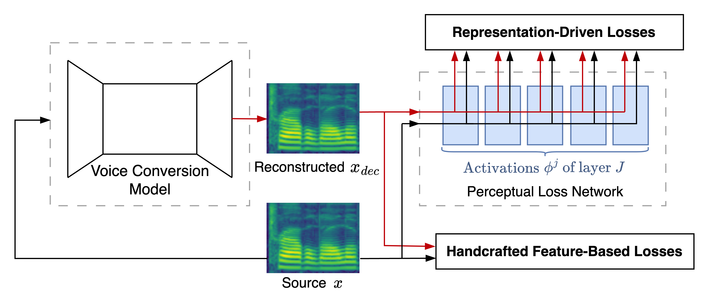

# Improving Voice Quality in Speech Anonymization With Just Perception-Informed Losses

### 🎉 Accepted at NeurIPS 2024 Audio Imagination Workshop 🎉

### 🚀 Overview
By adding perception-informed loss functions during training of a voice conversion (VC) model, optimization can be aligned more towards human optimization, potentially making use of more complex architectures or loss functions obsolete. We propose model-agnostic loss functions that capture representations about speech quality; focussing on intelligibility, prosody and naturalness. We categorize into handcrafted-feature losses based and representation driven losses. Our framework improves performance of the VC model across various datasets, languages, target speakers, and genders without increasing the capacity of the VC model itself.

  

## 🧠 Links
- Paper: https://arxiv.org/abs/2410.15499
- Poster at NeurIPS: https://drive.google.com/file/d/1gv2IgZtfGaEm9E8X1qRiTJfkbakKn0_l/view?usp=share_link
- 5 min Presentation: t.b.a.
- Audio Samples: t.b.a.

## 💻 Code
### Setup
To replicate our results, follow these steps: t.b.a.
